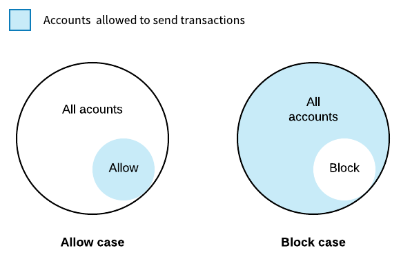
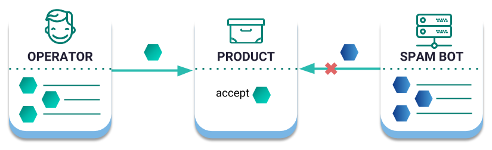

<h2>账户过滤器</h2>

!> 账户过滤器功能还没在SDK中实现

帐户可以配置一组智能规则，以阻止在给定一系列约束的情况下通知或接收交易。

可编辑的链上约束称为过滤器。帐户可以配置以下类型：

<h2>地址过滤器</h2>
帐户可以决定仅从允许的地址列表接收交易。同样，帐户可以指定不希望从中接收交易的地址列表。

!> 允许和阻止过滤器是互斥的。换句话说，帐户只能为每种类型的过滤器配置阻止或允许列表

默认情况下，如果没有设置过滤器，则网络中的所有帐户都可以向指定的帐户发布交易。

<h2>马赛克过滤器</h2>
只有在允许附加所有马赛克的情况下，帐户才能配置过滤器以允许传入事务。另一方面，该帐户可以拒绝接受包含列为已阻止的马赛克的交易。

<h2>EntityType过滤器</h2>
帐户可以允许/阻止使用确定的类型宣布传出交易。通过这样做，它增加了它的安全性，防止了错误地发布了不希望的交易。

<h2>示例</h2>
<h2>阻止垃圾邮件交易</h2>
一家公司正在使用公有链来证明其产品的质量。
当质量验证过程结束时，操作员向产品帐户发送质量标签。
最终客户可以查看扫描QR码的产品马赛克。出于这个原因，该公司只想显示相关交易，避免其他人用非相关信息向他们的产品发送垃圾邮件。

阻止垃圾邮件交易

该公司选择配置其产品帐户过滤器，仅允许接收包含`company.quality:seal`马赛克的交易。

<h2>增强账户安全性</h2>
最近，Alice只使用她的主要的多签帐户来共同签署聚合交易。
作为一项临时措施，Alice选择禁止从她的主账户宣布转账交易，仔细检查她所拥有的任何资金是否会被转移。

<h2>Schemas</h2>

!> 配置参数是可编辑的。公共网络配置可能不同
