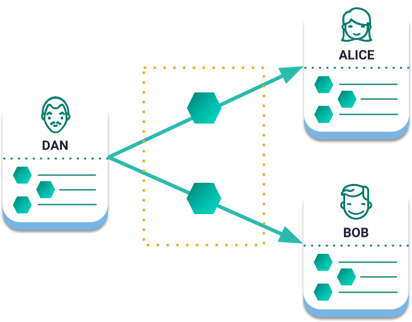
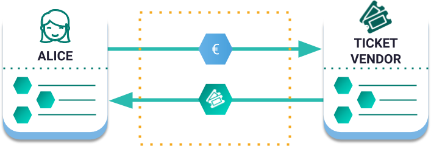
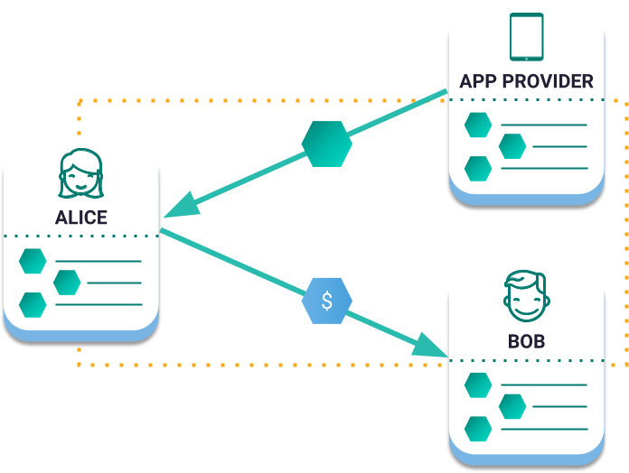
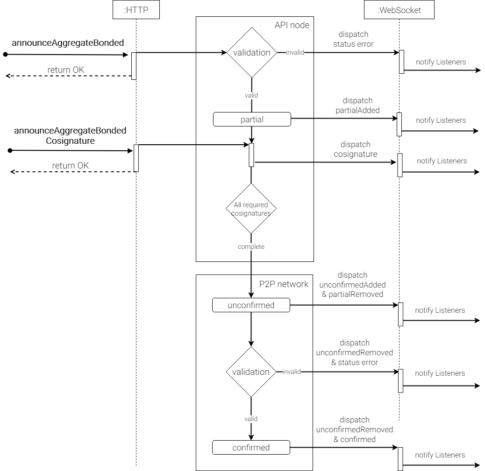

<h1>聚合交易</h1>

聚合交易将多个交易合并为一个，允许无信任交换和其他高级逻辑。

NEM通过生成一次性智能合约来实现这一目标。当所有涉及的帐户都已签署聚合交易时，所有内部交易都会同时执行。

<h2>示例</h2>

<h2>示例</h2>

<h3>发起付款</h3>

Dan宣布合并两笔转账交易的合计交易。

由于他是唯一需要签名的人，我们说汇总交易是完整的。在宣布它到网络后，Alice和Bob将同时收到马赛克。

<h3>多资产托管交易</h3>

在这个例子中，Alice正在购买货币：欧元的门票。当票证分发者汇总聚合事务时，交换将以原子方式发生

<h3>支付其他费用</h3>

Alice使用应用程序向Bob发送10欧元以进行付款。但她没有任何XEM支付区块链交易费。

通过创建聚合保税交易，她可以将美元转换为XEM以支付费用。现在Alice和Bob可以使用NEM区块链而无需购买或持有XEM。

由于应用创建者可以将自己的品牌放在开源的支付应用上，因此Alice和Bob可能甚至不知道他们正在使用区块链。

<h2>聚合完成</h2>

当所有签名者签名时，汇总交易完成。

不同的参与者可以在不使用区块链的情况下签署聚合交易。一旦它具有所有必需的签名，其中一个可以将其通告给网络。如果内部交易设置有效，并且没有验证错误，则交易将同时执行。

通过在同一操作中的不同参与者之间收集多个内部交易，聚合完成交易允许每个块添加更多交易。

<h2>聚合绑定</h2>

当聚合交易需要来自其他参与者的签名时，它将被绑定。

!> 发送聚合保税交易时，帐户必须首先宣布并确认此聚合的哈希锁定交易至少有10XEM。

一旦公布了聚合绑定，它就会达到部分状态并通过WebSockets或HTTP API调用通知其状态。

每当协同签署交易并宣布汇总保税合约时，网络都会检查所有必需的合作伙伴是否已经签署。

在这种情况下，交易将更改为未确认状态，直到网络接受它，并且一旦处理就包含在块中。

通过在同一操作中的不同参与者之间收集多个内部交易，聚合完成交易允许每个块添加更多交易。

<h2>相关文档</h2>

<h2>Schemas</h2>

!> 配置参数是可编辑的。公共网络配置可能不同。

<h2>AggregateTransaction</h2>

**Version**: 0x01

**Entity type**: 0x4141 (complete), 0x4241 (bonded)

**Inlines**:

Transaction

transactions：交易数组

> 由不同帐户发起的交易。聚合交易最多可包含`1000`个，涉及`15`名共同签署人的内部交易。其他聚合交易不允许作为内部交易。 
cosignatures：共同签署人数组

<h2>CosignatureTransaction</h2>

Cosignature交易用于签署已公布的缺少共同签名的聚合保税交易

> Hash  
聚合绑定交易Hash到cosign

<h2>HashLockTransaction</h2>

别名：LockFundsTransaction

在发送签名聚合绑定交易之前宣布Hash锁交易。需要此机制来防止网络垃圾邮件。

确认相关的聚合保税交易后，锁定的资金将在签署初始Hash锁定交易的帐户中再次可用。

如果在未经所有签名人签名的情况下达到聚合保税交易持续时间，则锁定的金额将由区块创建者在锁定到期时的高度收回。

**Version**: 0x01

**Entity type**: 0x4148

**Inlines**:

Transaction或EmbeddedTransaction

|属性|类型|说明|
|:---|:---|:---|
|mosaic|Mosaic对象|被锁定的马赛克。至少有`10 nem:xem`|
|duration|uint64|锁定持续时间|
|hash|32 bytes (binary)|在解锁马赛克之前必须确认的聚合绑定交易的Hash值|
