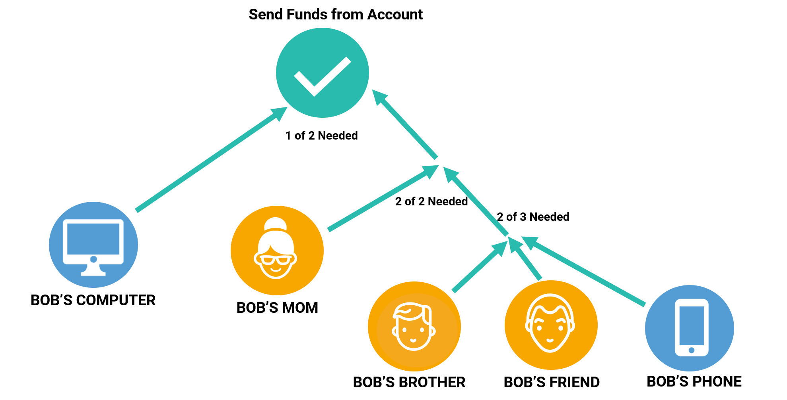

<h2>多层多重签名账户</h2>

多重签名账户也可以作为其他多重签名账户的共同签署人。多层多重签名账户(Multi-Level Multisig Account)为多签交易添加"And/OR"逻辑。

一个多层多重签名账户最大深度是`3`

!> 配置参数是可编辑的。公共网络配置可能不同。

<h2>示例</h2>

多层多重签名账户允许各种各样的业务逻辑

<h2>制造和供应链</h2>

在该示例中，制造商正在运送药品。

只有当其区块链记录显示其具有生产日期，安全检查并且在正确的温度下运输时，该产品才会获得其质量认证马赛克。

装运箱中的传感器每5分钟报告一次温度数据并将其合并到每日报告中。

<h2>欺诈检测</h2>

此示例显示如何使高安全性帐户更易于使用。

交易仅通过硬件钱包或您的手机和欺诈检测AI批准。多层多重签名账户允许协议级别的各种安全配置，以保持企业及其客户无黑客攻击。

<h2>帐户恢复</h2>

您可以设置帐户，只有在批准指定帐户（例如您的朋友和家人）的签名后才能恢复帐户。以您喜欢的方式组合分支。

<h2>相关文档</h2>

[创建多层多重签名](https://nemtech.github.io/guides/account/creating-a-multi-level-multisig-account.html)
