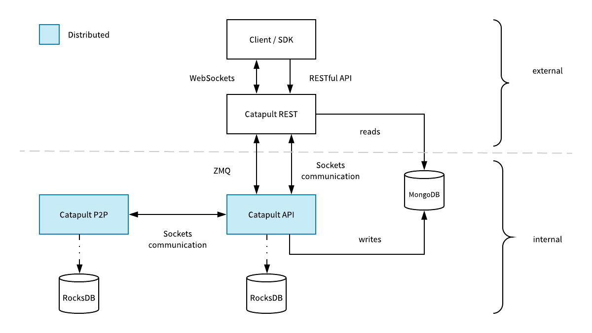

### 节点

NEM区块链平台是由节点网络构建的。这些节点提供了一个功能强大，稳定且安全的平台，可以将智能资产(Smart Assets)交易传输，搜索并不可变地记录到区块链分类帐中。

这种四层体系结构允许开发人员在不中断其他层的情况下更新任何这些层，从而提高安全性

### Catapult P2P组件

**Github:**  [Catapult Server](https://github.com/nemtech/catapult-server)

P2P节点构成了区块链的主干。P2P节点的作用是验证交易和区块，运行一致性算法，创建新块，并通过网络传播更改。
API节点将新交易推送到P2P节点。如果收到的交易无效，则P2P节点将其丢弃。

处理完块后：

1. 块二进制文件作为平面文件保存在磁盘上。
2. 更新的链状态保存在内存或RocksDB（可配置）中。

### RocksDB

RocksDB存储链状态。缓存的数据结构被序列化并作为值(Value)存储到对应的键(Key)。换句话说，支持不同的“列”（键/值对“表”）。

例如，列将公钥映射到地址。另一个，帐户状态条目作为对应地址密钥的值。

将状态存储在内存中比使用RocksDB更快。但是，在RocksDB中存储状态信息需要较少的内存网络节点。这在具有大量帐户的网络中主要是期望的。

### Catapult API组件

**Gitbub:** [Catapult REST](https://github.com/nemtech/catapult-rest)

Catapult API的主要职责是以可读的形式存储数据。每个API实例都维护一个MongoDB，并可选择使用RocksDB来保存状态。

该层验证从REST组件接收的交易。此外，API通过ZMQ以二进制方式返回错误。

Catapult API组件还负责收集共签名。聚合的绑定交易一旦完成就会被推送到P2P节点。

API组件可以连接到多个P2P节点，但至少必须连接到一个。

### MongoDB

MongoDB存储区块，交易和链状态，以实现高查询性能。

API在以下情况下更新MongoDB：

* 一个新的区块/一堆区块完成处理。
* 新的未经证实的交易已完成处理。

!> 不应在外部访问MongoDB

### ZMQ

ZeroMQ是一个异步消息库，支持实时订阅。它将通知从API服务器传输到Catapult REST组件侦听的ZMQ端点。它是REST WebSockets的替代方案，旨在在性能至关重要时使用。

### Catapult REST组件

**Github**： [Catapult REST](https://github.com/nemtech/catapult-rest)

Catapult REST处理JSON API客户端请求。该组件从MongoDB读取，格式化响应，并将其返回给客户端。每个Catapult REST都连接到一个Catapult API实例。

Catapult REST使用Sockets将新交易发送到Catapult API。该组件通过WebSockets向客户端发布事件。

### 指南

* [在本地运行Catapult](https://github.com/tech-bureau/catapult-service-bootstrap/)  
部署Catapult节点以用于学习和开发目的。
