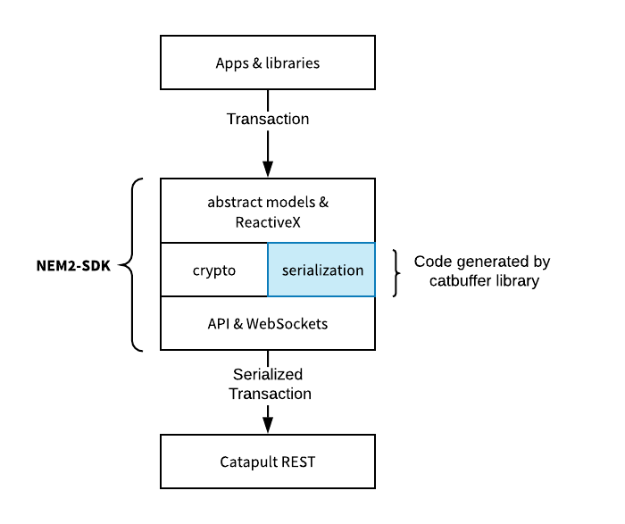

### 序列化

[Catbuffer library](https://github.com/nemtech/catbuffer)定义了序列化和反序列化投石车实体的协议。该库可为不同语言生成代码。
SDK和应用程序使用生成的代码与REST节点进行交互。



该库实现如下属性：

 **内存效率**

大型网络计算大量事务。使用大小优化的二进制文件可以加快通信速度。此外，从内存缓冲区读取实体或者只是它们的一部分是**内存有效**的。

**灵活性**

REST[transaction endpoints](https://nemtech.github.io/api/endpoints.html#operation/announceTransaction)处理更新区块链状态的调用。
交易的序列化有效负载附加到POST调用的主体。这些端点允许在不修改API协议的情况下向服务器端添加新功能。

**可重用性**

应用程序可以嵌入生成的代码，而无需管理依赖项。这在高度安全的环境中尤其需要。此外，共享公共代码库可以更轻松地添加新功能。
目前，您可以为C++生成缓冲区。Javascript和Python正在开发中。如果您正在使用其他语言开发SDK，请考虑编写新的生成器。

### Schema

一个Schema文件定义实体的数据结构。该库为与定义的实体生成序列化和反序列化所需的最精简代码。
目前支持以下实体：

|Schema文件|说明|
|:---|:---|
|[entity.cats](https://github.com/nemtech/catbuffer/blob/master/schemas/entity.cats)||
|[accountlink.cats](https://github.com/nemtech/catbuffer/blob/master/schemas/accountlink.cats)| |
|[hashlock.cats](https://github.com/nemtech/catbuffer/blob/master/schemas/hashlock.cats)| |
|[secretlock.cats](https://github.com/nemtech/catbuffer/blob/master/schemas/secretlock.cats)| |
|[lockhashtypes.cats](https://github.com/nemtech/catbuffer/blob/master/schemas/lockhashtypes.cats)| |
|[secretproof.cats](https://github.com/nemtech/catbuffer/blob/master/schemas/secretproof.cats)| |
|[transfer.cats](https://github.com/nemtech/catbuffer/blob/master/schemas/transfer.cats)| |
|[transaction.cats](https://github.com/nemtech/catbuffer/blob/master/schemas/transaction.cats)| |
|[types.cats](https://github.com/nemtech/catbuffer/blob/master/schemas/types.cats)| |

### 解析schema和生成代码

使用其中一种可用语言生成确定模式的代码。例如，运行以下命令以生成C++代码以序列化和反序列化传输交易：

```
$> python main.py -i schemas / transfer.cats -g cpp-builder
```

生成器在`_generated/cpp`文件夹下创建一个新文件。根据需要使用不同的输入模式`(-i)`或生成器重复此过程`(-g)`。

### 写一个schema

你在写一个包含新交易类型的新Catapult插件吗？

在此示例中，我们将研究[transfer.cats](https://github.com/nemtech/catbuffer/blob/master/schemas/transfer.cats) schema文件的工作原理。

按照相同的步骤定义新schema。

首先，在schemas文件夹下创建一个新文件，并为交易主体定义一个结构。将结构视为一组我们想要存储在同一内存块中的属性。

交易正文包含与基本交易不同的额外属性。每个属性都可以具有`types.cats`中定义的类型之一。

```
# binary layout for a transfer transaction
struct TransferTransactionBody
    # transaction recipient
    recipient = UnresolvedAddress
    # size of attached message
    messageSize = uint16
    # number of attached mosaics
    mosaicsCount = uint8
    # transaction message
    message = array(byte, messageSize)
    # attached mosaics
    mosaics = array(UnresolvedMosaic, mosaicsCount, sort_key=mosaicId)
```
 
其次，在同一文件中定义第二个事务结构。这将包含有关实体版本及其标识符的信息。底层交易属性和特定交易主体作为内联附加。

```
# binary layout for a non-embedded transfer transaction
struct TransferTransaction
    const uint8 version = 3
    const EntityType entityType = 0x4154

    inline Transaction
    inline TransferTransactionBody
```

最后，定义一个Embedded Transaction结构。此结构用于序列化内部事务。嵌入式事务和正文事务将作为内联添加。

```
# binary layout for an embedded transaction
struct EmbeddedTransaction
    inline SizePrefixedEntity
    inline EntityBody
```

### 集成

将生成的代码添加到[SDK](https://nemtech.github.io/api/serialization.html#adding-generated-code-to-an-sdk)

编译所选语言的所有模式后，将生成的文件移动到`model/transactionSDK`文件夹。

!> 本节不完整。更新NEM2-SDK后，将发布更多信息。
